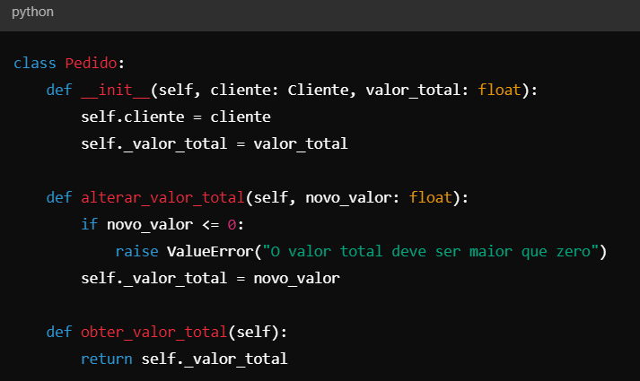
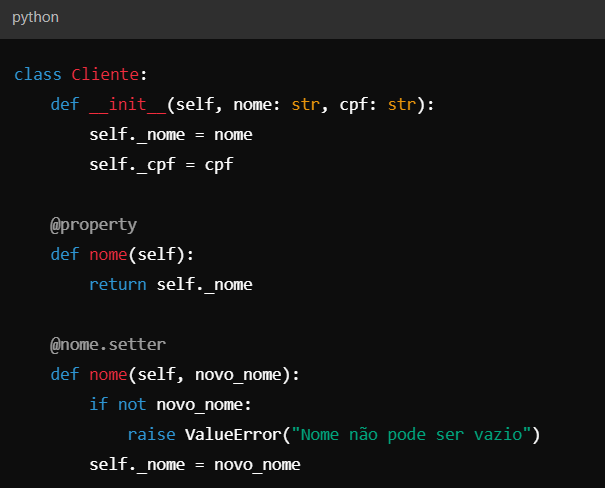
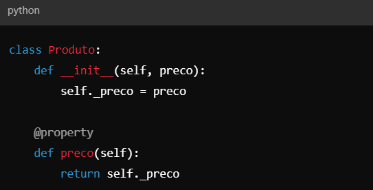
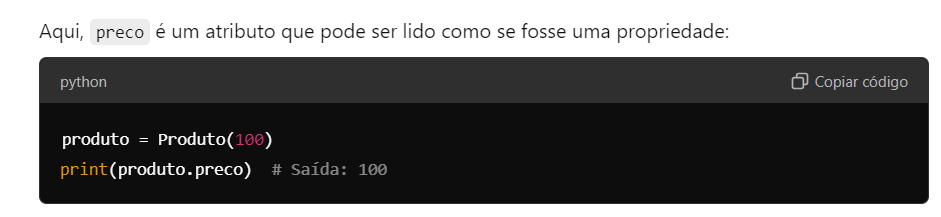
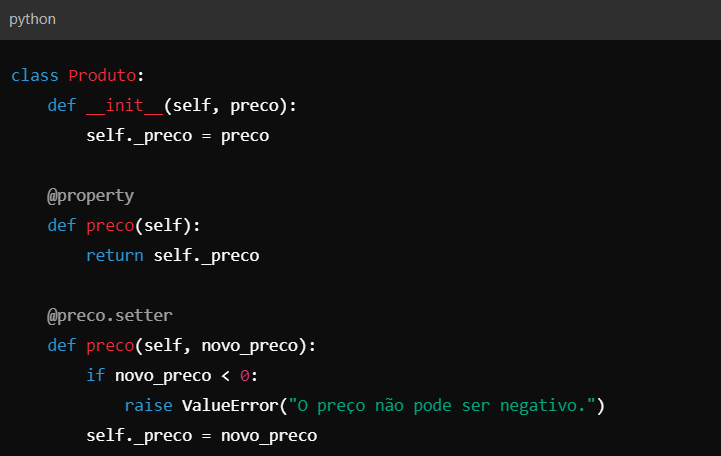
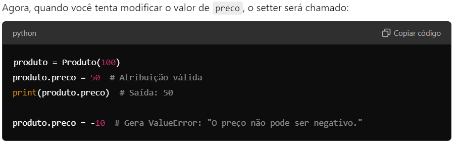
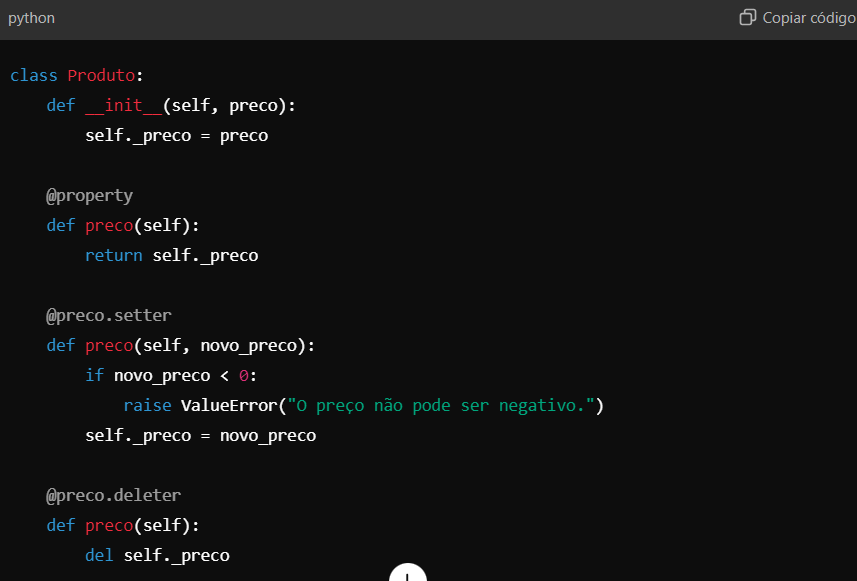
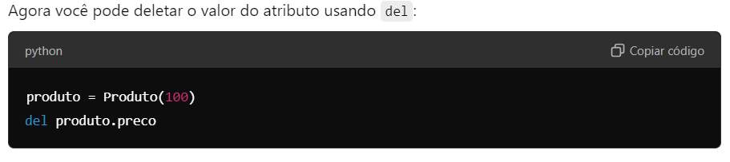

# Django template for a new django CMS 4 project

A Django template for a typical django CMS installation with no 
special bells or whistles. It is supposed as a starting point 
for new projects.

If you prefer a different set of template settings, feel free to 
create your own templates by cloning this repo.

To install django CMS 4 by hand type the following commands:

1. Create virtual environment and activate it
   ```
   python3 -m venv .venv
   source .venv/bin/activate
   ```
2. Install Django, django CMS and other required packages
   ```
   pip install django-cms
   ```
3. Create project `<<project_name>>` using this template
   ```
   djangocms <<project_name>>
   cd <<project_name>>
   ```
4. Run testserver
   ```
   ./manage.py runserver
   ```

Note: If you run into a problem of missing dependencies, please
update `pip` using `pip install -U pip` before running the 
`djangocms` command.

# atualiza as dependências 
pip-compile requirements.in
# instala as dependências 
pip install -r requirements.txt
# sincroniza os ambientes
pip-sync
# prepara os arquivos para persistência
python manage.py makemigrations
# migrate banco bd postgres
python manage.py migrate --database=default
# executa o servidor djanfo
python manage.py runserver

# as importações de material desing deve ser: 
from viewflow.material import SomeClass


# iniciar repositório local 
git init

# listar todos os arquivos, incluindo arquivos ocultos, 
Get-ChildItem -Force

# consultar em qual branch está:
git branch

# criar uma nova branch 
git checkout -b feature/models

# ir para uma branch criada ou mudar de branch
git checkout nome-da-branch

# listar as branches locais e remotas
git branch -a

# desenvolver e adicionar arquivos ao índice
git add .

# fazer um commit 
git commit -m "Descrição do que foi feito"

# verificar o histórico do commits
git log

# enviar a branch para o repositório remoto
git push origin nome-da-branch

# fazer o merge da branch secundária na principal
# o merge deve ser feiro da branch que vai ser atualizada.
# a branch a ser informada é da qual as informações serão importadas.  
git merge nome-da-branch 

# commit de resolução de conflitos do merge
git add .
git commit -m "Resolve conflitos de merge"

# puxa as alterações da branch main no repositório remoto origin para o local.
git pull origin main

# "envia minhas alterações do local para a branch main no repositório remoto origin".
git push origin main

#  verificar se "origin" é o nome do repositório remoto padrão e quais repositórios remotos estão configurados, use:
git remote -v

# para atualizar a branch remota com as mudanças feitas localmente na branch
# quando local e remoto estão sincronizados. 
git push origin feature/models

# verificar se há alguma diferença entre a branch local e a remota usando:
git fetch origin
git status

# para comparar os commits entre a branch local e a remota:
git log origin/feature/models..feature/models

# confirmar que a branch local está rastreando a branch remota:
git branch -vv


====================
Convenções de codificação
====================

# Visão Geral das Convenções

====================
# Convenção quanto as classes 
====================

1. nomeação de classes
Os módulos são nomeados em português e as classes com os conceitos em portugues e a camada em inglês.  

# DOMINIO
Classes de Entidades, Objetos de Valor e Agregados
O módulo é nomeado com o conceito que ele implementa e a classe com conceito seguido de "Domain" 
Ex. 
# módulo - produto.py
# classe - ProdutoDomain

Classes de Repositórios Abstratos
O módulo é nomeado com o conceito que ele implementa e a classe com conceito seguido de 'Contract'
Ex. 
# módulo - produto.py
# classe - ProdutoContract

# INFRAESTRUTURA 

Classes de Repositórios Concretos
# módulo - produto.py
# classe - ProdutoRepository

Classes de modelo 
# módulo - produto.py
# classe - ProdutoModel

==================================
# Convenção para importação de classes:
==================================
# Domínio:
As classes de domínio não importam outras classes dos relacionamentos.
Os atributos oriundos dos relacionamentos são declarados sem id.

# Contratos do Domínio:
Definem as ações a serem implementadas pelos repositórios. Não importam outras classes.

# Repositórios Concretos:
Importa a classe de domínio relacionada e o repositório concreto correspondente.

# Models:
Interagem, com o seu repositório e as models relacionadas diretamente.

================
# Convenção de Identificação (ID), validação, acesso e modificação:
================

Domínio: Utilizar apenas id nas classes de domínio.
Infraestrutura: Utilizar objeto_id 
Ex.: pessoa_fisica_id nas models e repositórios.

================
# Convenção para Chave Primária:
================

Utilizar models.BigAutoField(primary_key=True) em todas as models para garantir consistência nas chaves primárias.
Ex: id = models.BigAutoField(primary_key=True)

=================
# Convenção para as validações pertinentes a cada conceito
=================

São realizadas na camada de domínio. Ela é responsável por conter a lógica de negócio, incluindo todas as regras e restrições que devem ser aplicadas às entidades e objetos de valor.
A camada de domínio tem a responsabilidade de garantir a integridade e consistência das operações relacionadas às regras de negócio. Portanto, qualquer validação ou lógica que se relacione com o comportamento de uma entidade ou com as regras do negócio está no escopo da classe Domain garantir que esses conceitos estejam sempre coerentes, independentemente da interface ou infraestrutura utilizada.

# Tipos de Validações no Domínio:

Validações de Invariantes: Garantem que a entidade esteja sempre em um estado válido. Por exemplo, em uma entidade de Cliente, uma validação garantiria que o CPF ou CNPJ seja sempre único e válido.

Validações de Regras de Negócio: Envolvem regras específicas, como limites de crédito ou restrições de data em uma entidade de Pedido, garantindo que o pedido tenha itens válidos e seja criado dentro de um período específico.

Validações de Consistência de Entidade: Validações que asseguram a integridade entre diferentes objetos do mesmo agregado, como garantir que um Pedido não possa ser finalizado se o Pagamento não estiver confirmado.

No app shared, temos a pasta validations. Os módulos de validação estão centralizados nela. 
em 27/09/2024 são os seguintes 





===========
# Convenção para acesso e modificação:
=========== 

Atributos Privados, sempre:

A classe usa atributos privados (_pessoa_fisica_tipo_id, _pessoa_fisica_id, etc.) para armazenar os dados.
Isso permite que as propriedades sejam acessadas e modificadas apenas através de métodos específicos (getters e setters).

# Getters:
Métodos como get_pessoa_fisica_id() são usados para acessar os atributos privados.
Retornam o valor atual dos atributos da instância.

# Setters:
Métodos como set_pessoa_fisica_id() são usados para modificar os valores dos atributos privados.
Aceitam um novo valor para o atributo e o definem na instância.

# Método __str__():
Retorna uma representação amigável da instância da classe quando convertida para uma string (ex: ao imprimir a instância).

# Considerações:
A classe encapsula seus atributos para garantir um controle melhor de como os valores são acessados e alterados.
Métodos de validação e lógica de negócio podem ser facilmente adicionados dentro dos getters e setters, como, por exemplo, verificações antes de atribuir novos valores.

=====================================================
# Como Implementar Setters e Getters de Forma Correta:
=====================================================

1. Use Métodos com Intenção Clara
Em vez de usar set_nome(), prefira algo como alterar_nome(), que pode conter regras de validação para alterar o nome, garantindo que o domínio esteja sempre em um estado consistente.

2. Métodos que Respeitam a Lógica de Negócio
Se um atributo puder ser alterado apenas sob certas condições, o método que modifica esse atributo deve incluir essa lógica.


3. Propriedades em Python (Property Decorator)
O Python tem uma maneira muito prática de definir getters e setters utilizando @property. Isso permite criar acesso controlado a atributos sem expor diretamente os métodos get e set, mantendo a interface mais limpa.


Vantagens de Usar o @property:
Simplicidade: O código parece um acesso direto ao atributo, mas ainda assim está encapsulado.
Controle: Você pode controlar o comportamento ao acessar ou modificar atributos, aplicando regras ou validações.
Flexibilidade: Facilita a refatoração. Se precisar adicionar validação mais tarde, o código que acessa o atributo não precisa ser alterado.

Quando Usar Getters e Setters Simples?
Na maioria das vezes, é desnecessário. Se você não precisa aplicar nenhuma lógica de validação ou transformação, pode expor diretamente o atributo (mas tenha cuidado para não violar o encapsulamento).
Usar getters e setters simples pode ser adequado em camadas mais simples ou DTOs (Data Transfer Objects), onde o comportamento é mínimo e os objetos são apenas "bolsões de dados".

================================
Aplicações do decorador de acesso
===============================

O @property não é restrito apenas para busca (leitura) de atributos. Ele também pode ser usado para modificar (escrita) um atributo por meio de um setter, controlando tanto o acesso quanto a modificação dos valores de um atributo de forma encapsulada e segura.

O decorador @property permite que você transforme um método em uma propriedade de leitura, ou seja, ele permite que o método seja acessado como se fosse um atributo, sem a necessidade de chamá-lo diretamente com parênteses.

No entanto, você pode combinar o getter com o setter e até um deleter, caso deseje controlar o comportamento de leitura, escrita e exclusão de um atributo.

Como Usar o @property para Leitura e Escrita

1. Getter (Leitura)
O @property é usado para definir o comportamento de leitura de um atributo.





2. Setter (Escrita)
Além do getter, você pode usar o @<propriedade>.setter para definir o comportamento de escrita de um atributo. Ele permite controlar como o valor do atributo é modificado, aplicando validações ou transformações.





3. Deleter (Remoção - Opcional)
Você também pode adicionar um deleter para definir o comportamento quando o atributo for excluído.





Conclusão:
O @property oferece uma maneira conveniente de ler e modificar atributos de forma encapsulada. A combinação de getter e setter permite controlar como os atributos são acessados e alterados. Isso mantém as entidades e objetos mais consistentes, seguras e alinhadas com as regras de negócio.

===============================================================
Em resumo:

@property: Controla a leitura de um atributo.
@propriedade.setter: Controla a escrita de um atributo.
@propriedade.deleter (opcional): Controla a remoção de um atributo.
================================================================

===========================================
# Convenção para implementação do modelo ER:
===========================================

# Um-para-Muitos:
Contexto: uma entidade (ou registro) em uma tabela pode estar relacionada a várias entidades (ou registros) em outra tabela, mas a segunda entidade só pode estar relacionada a uma única entidade na primeira tabela.
Aplicação: implementado por meio de uma chave estrangeira (ForeignKey) na tabela "muitos", apontando para a tabela "um". A tabela que contém muitos registros tem a chave estrangeira da entidade que representa um único registro.
Ex: 

class Cliente(models.Model):
    id = models.BigAutoField(primary_key=True)
    nome = models.CharField(max_length=255)

class Pedido(models.Model):
    id = models.BigAutoField(primary_key=True)
    cliente = models.ForeignKey(Cliente, on_delete=models.CASCADE)  # Definição do relacionamento
    descricao = models.CharField(max_length=255)

ForeignKey define o relacionamento.
O on_delete=models.CASCADE indica que, se o cliente for deletado, seus pedidos também serão deletados.

# Muitos-para-Muitos:
Contexto: ocorre quando várias entidades de uma tabela podem estar relacionadas a várias entidades de outra tabela.
Aplicação:  implementado através de uma tabela intermediária (ou tabela de junção/associativa) que contém as chaves estrangeiras de ambas as tabelas envolvidas no relacionamento. 
Ex 1. Caso não seja necessário incluir atributos na associativa ou não seja o caso de explicitá-la em uma model, o Django gera ela automaticamente 

class Aluno(models.Model):
    id = models.BigAutoField(primary_key=True)
    nome = models.CharField(max_length=255)

class Curso(models.Model):
    id = models.BigAutoField(primary_key=True)
    nome = models.CharField(max_length=255)
    alunos = models.ManyToManyField(Aluno)  # Definição do relacionamento

# ManyToManyField define o relacionamento.
# Django cria uma tabela intermediária automaticamente para armazenar as relações entre Aluno e Curso.

Ex 2. Se a model da tabela associativa for explicitada e ou receber atributos. 

class Aluno(models.Model):
    nome = models.CharField(max_length=100)
    email = models.EmailField()

    def __str__(self):
        return self.nome

class Curso(models.Model):
    nome = models.CharField(max_length=100)
    descricao = models.TextField()

    def __str__(self):
        return self.nome

# Model intermediária que define a tabela associativa
class Matricula(models.Model):
    aluno = models.ForeignKey(Aluno, on_delete=models.CASCADE)
    curso = models.ForeignKey(Curso, on_delete=models.CASCADE)
    data_matricula = models.DateField()
    status = models.CharField(max_length=50)

    class Meta:
        constraints = [
        models.UniqueConstraint(fields=['aluno', 'curso'], name='unique_matricula')
    ] #define chave composta

# Comentários sobre a definição da chave composta

fields: Define os campos que compõem a chave composta. Neste caso, a combinação dos campos aluno e curso precisa ser única. Isso significa que, por exemplo, um aluno não pode se matricular duas vezes no mesmo curso.
name: Define o nome da restrição de unicidade no banco de dados. Nesse exemplo, a restrição se chamará unique_matricula.

    def __str__(self):
        return f'{self.aluno} matriculado em {self.curso}'

# Definindo o relacionamento ManyToMany com o parâmetro 'through'
class Aluno(models.Model):
    nome = models.CharField(max_length=100)
    cursos = models.ManyToManyField(Curso, through='Matricula')

    def __str__(self):
        return self.nome

# Explicação:
# Aluno e Curso são as entidades principais.
# Matricula é a tabela intermediária (model associativa) que contém atributos adicionais como data_matricula e status.
unique_together define uma chave composta (aluno, curso), garantindo que um aluno não possa se matricular no mesmo curso duas vezes.
O relacionamento ManyToMany entre Aluno e Curso é definido por meio do parâmetro through='Matricula'.

# Um-para-Um:
Contexto: ocorre quando uma entidade em uma tabela está relacionada a exatamente uma entidade em outra tabela, e vice-versa.Ou seja, duas entidades estão diretamente ligadas em uma relação de um-para-um.
Aplicação: uma chave estrangeira é criada, mas com a restrição de que cada registro de ambas as tabelas pode ter no máximo uma relação.

Ex. 
class Usuario(models.Model):
    id = models.BigAutoField(primary_key=True)
    nome = models.CharField(max_length=255)

class Perfil(models.Model):
    id = models.BigAutoField(primary_key=True)
    usuario = models.OneToOneField(Usuario, on_delete=models.CASCADE)  # Definição do relacionamento
    bio = models.TextField()

OneToOneField define o relacionamento.
O on_delete=models.CASCADE indica que, se o usuário for deletado, o perfil também será deletado.

# Convenção para os contratos do Domínio.

class ClienteContract:
    def get_by_id(self, id: int) -> Cliente:
        """Recupera uma entidade Cliente pelo seu ID."""
        pass
    
    def list_all(self) -> List[Cliente]:
        """Retorna todas as entidades Cliente."""
        pass
    
    def save(self, cliente: Cliente) -> None:
        """Salva ou atualiza a entidade Cliente no repositório."""
        pass
    
    def delete(self, id: int) -> None:
        """Remove uma entidade Cliente do repositório pelo ID."""
        pass
    
    def search_by_criteria(self, criteria: dict) -> List[Cliente]:
        """Busca entidades Cliente com base em critérios especificados no repositório."""
        pass
    
    def count(self) -> int:
        """Retorna o número total de entidades Cliente no repositório."""
        pass
    
    def exists(self, id: int) -> bool:
        """Verifica se uma entidade Cliente com o ID fornecido existe no repositório."""
        pass

  # Exemplo de contrato com busca definida. 
    def search_by_cidade(self, cidade: str) -> List[Cliente]:
    """Busca clientes por cidade"""

# Convenção para lançamento de exceções. 

# Tipos de Exceções
As exceções devem ser consistentes e claras, utilizando classes específicas que refletem os diferentes tipos de erros possíveis. Abaixo estão exemplos de exceções recomendadas para uso nos contratos:

EntityNotFoundException: Quando uma entidade solicitada não é encontrada no repositório.
BusinessRuleViolationException: Quando uma regra de negócio é violada.
DataIntegrityException: Quando há uma violação de integridade de dados (como restrições de chave).
OperationNotAllowedException: Quando uma operação não é permitida em um determinado estado da entidade.
ValidationException: Quando uma validação de domínio falha ao tentar salvar ou modificar uma entidade.
Essas exceções devem ser definidas no módulo de exceções personalizadas e capturadas no nível de contrato para garantir um comportamento previsível e rastreável.
