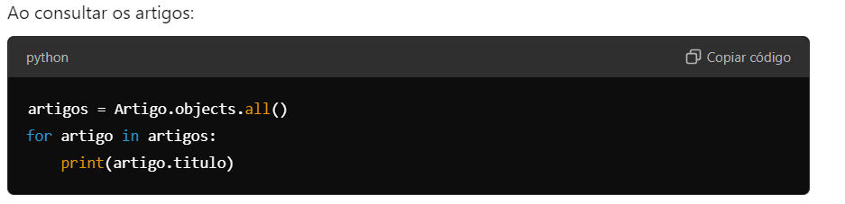
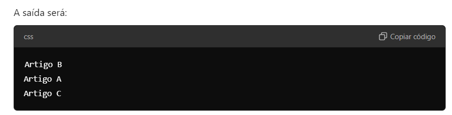

# OrderingMixin
Objetivo: Garantir que todos os modelos implementem uma ordem padrão ao serem consultados. Este mixin adiciona um campo de ordenação e configura o ordenamento padrão do modelo.
Quando usar: Em qualquer modelo onde a ordenação seja importante para a apresentação dos dados.

# Como o OrderingMixin funciona?
Com essa configuração, toda vez que você consultar os artigos no banco de dados, eles serão automaticamente ordenados pelo campo order, conforme definido na Meta do OrderingMixin.

Exemplo de Uso
Vamos supor que você tenha os seguintes artigos no banco de dados:

Artigo A (order=2)
Artigo B (order=1)
Artigo C (order=3)

A variável order no contexto do OrderingMixin está recebendo um valor do tipo PositiveIntegerField, que é um campo numérico inteiro positivo fornecido pelo Django. Este campo é utilizado para determinar a ordem de exibição dos registros no banco de dados.

# Detalhamento do Funcionamento
Campo order:

Tipo: models.PositiveIntegerField
Descrição: Este campo armazena um número inteiro positivo, que representa a posição ou ordem do item em uma lista.
Valor Padrão: default=0, ou seja, se nenhum valor for explicitamente atribuído ao campo order durante a criação de um registro, ele será automaticamente configurado como 0.
Função da Variável order:

# Ordenação: O valor armazenado no campo order é utilizado para determinar a ordem em que os registros aparecem quando você consulta o banco de dados. No contexto do mixin OrderingMixin, essa ordenação é definida na classe Meta através do parâmetro ordering = ['order'], o que instrui o Django a sempre retornar os registros ordenados com base no valor de order.
Exemplo de Valores no Campo order
Suponha que você tenha três registros com os seguintes valores para o campo order:

Registro 1: order = 2
Registro 2: order = 1
Registro 3: order = 3
Ao consultar esses registros, o Django os retornará na seguinte ordem:

Registro 2 (order = 1)
Registro 1 (order = 2)
Registro 3 (order = 3)
Conclusão

O campo order está recebendo um número inteiro positivo que é usado para determinar a posição relativa dos registros em uma lista ordenada. A ordenação padrão definida em Meta faz com que todos os registros sejam automaticamente ordenados com base no valor deste campo ao serem recuperados do banco de dados.

